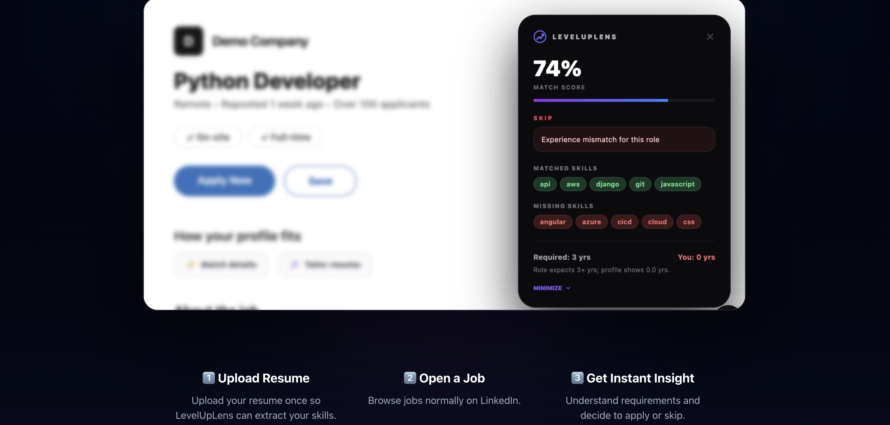
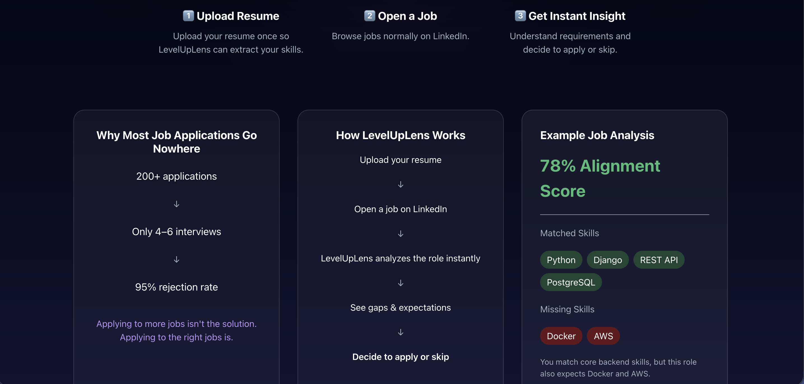
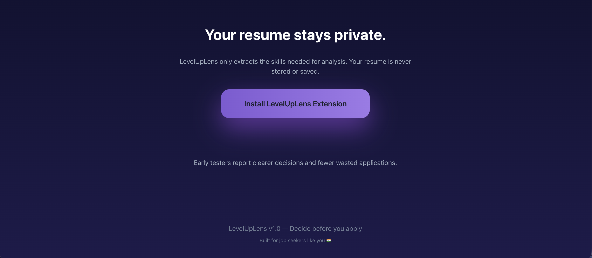

# 🚀 LevelUpLens

### Know why you might get rejected — before you apply.

Most job seekers apply blindly.

LevelUpLens analyzes job descriptions and shows what the role actually expects — so you can decide if applying makes sense before you waste time.

> 💡 LevelUpLens gives insights — you decide where to apply.

---

## 📊 What You Get

- See how well you align with a role  
- Identify missing skills instantly  
- Understand expectations clearly  
- Decide: apply or skip  

---

## ⚙️ How It Works

1. Upload your resume  
2. Open any job on LinkedIn  
3. Get instant insight  
4. Decide whether to apply  

---

## ❌ The Problem

- 200+ applications → only a few interviews  
- Job descriptions are unclear  
- Rejections happen without feedback  
- You don’t know what you're missing  

Most people try to fix this by applying more.

That’s not the solution.

---

## ✅ The Shift

Apply smarter — not more.

LevelUpLens helps you:
- Understand what a job really expects  
- Identify gaps before applying  
- Avoid low-probability applications  
- Save time and energy  

---

## 🔐 Privacy First

- Your resume never leaves your browser  
- No storage, no accounts required  
- Only skills are extracted for analysis  

---

## 🚀 Get Started

- Install the Chrome extension  
- Upload your resume once  
- Analyze any job instantly  

---

## 🔗 Project Components

- 🔌 Chrome Extension:  
- ⚙️ Backend API: 

---

## ⚡ Tech Stack

- Frontend: React + Chakra UI  
- Backend: Django  
- Extension: Chrome Extension (Manifest V3)  

---

## ⭐ Why LevelUpLens?

Because applying blindly is the real problem.

LevelUpLens helps you **make informed decisions before you apply** — not after you get rejected.
